 

---

## Hey, I'm Sukhbir

26 years old. I break systems to understand them, then build better defenses. Detection pipelines, risk assessment and hunting for the gap between what a security policy says and what a network actually does.

For my bachelor thesis I performed a full manual penetration test of a real startup's web application using OWASP WSTG and NIST SP 800-115. No automated scanner shortcuts — the goal was finding what tools miss. The report included real findings, severity ratings and remediation steps that improved their security posture.

I also built a GUI for Volatility 3, a memory forensics tool used in professional incident response, in collaboration with a cybersecurity company. Powerful tools should not require a manual to use.

Now I spend my time building the things I describe in interviews. Every project on this profile has real code, real output and a reason it exists.

---

---

## What I work with

<table>
<tr>
<td valign="top" width="33%">

**Offensive**
- Manual penetration testing
- Web application security
- Vulnerability research
- MITRE ATT&CK mapping
- Network exploitation

</td>
<td valign="top" width="33%">

**Defensive**
- Detection engineering
- Log analysis and alerting
- Threat intelligence (CTI)
- Incident response (NIST 800-61)
- Brute force and anomaly detection

</td>
<td valign="top" width="33%">

**Governance**
- Risk scoring (likelihood x impact)
- ISO 27001 and NIST CSF
- Compliance gap analysis
- Security policy writing
- Cloud security (AWS, CIS benchmark)

</td>
</tr>
</table>

  

  
  &nbsp;
  
  &nbsp;
  
  &nbsp;
  
  &nbsp;
  
  &nbsp;
  

---

## Projects

### SOC + GRC — Security Operations and Governance

The project I'm most proud of. Covers both detection engineering and governance — and demonstrates the feedback loop between them. When the SOC detects an attack, that finding feeds the GRC risk register, which updates the policy, which creates a new detection rule.

`Python` `MITRE ATT&CK` `ISO 27001` `NIST CSF` `AbuseIPDB` `nmap` `24 tests passing`

---

### SOC Project — Detection Engineering

Log parsing pipeline, MITRE ATT&CK-mapped alert engine, sliding window brute force detector and AbuseIPDB threat intelligence. Daily automated scans via GitHub Actions. Every alert tells you not just what happened but what tactic the attacker is using.

`Python` `MITRE ATT&CK` `AbuseIPDB` `Detection Engineering` `NIST SP 800-61`

---

### GRC Project — Risk and Compliance

Risk matrix, network exposure scanner, ISO 27001 and NIST CSF compliance checklist, security policy templates and automated weekly reports. Validates whether a network actually matches what the security policy says it should.

`Python` `ISO 27001` `NIST CSF` `nmap` `Risk Assessment` `Gap Analysis`

---

### Cloud Security — AWS Misconfiguration Scanner

Scans AWS accounts for the misconfigurations that cause real-world data breaches — public S3 buckets, overprivileged IAM users, dangerous security group rules, disabled CloudTrail logging. Mapped to the CIS AWS Foundations Benchmark.

`Python` `AWS boto3` `IAM` `S3` `CloudTrail` `CIS Benchmark`

---

## Test your knowledge

25 questions across SOC and general cybersecurity — MITRE ATT&CK, cryptography, cloud security, incident response, web application security and more.

---

---

## Stats

---

